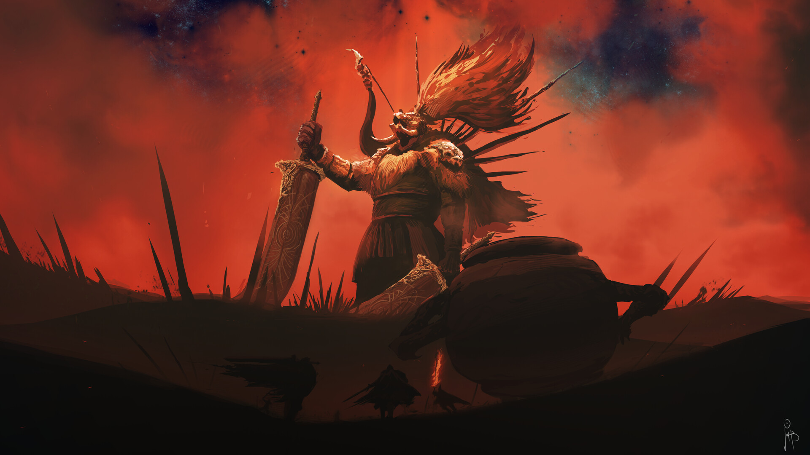

<h1>Memoria del proyecto fin de evaluación de Lenguajes de Marcas - 1º DAM/DAW</h1>
<h2>Págino como tributo a Elden Ring</h2>
<h2>Indice</h2>
<ul>
  <li><a href="#introduccion">Introducción</a></li>
  <li><a href="#motivacion">Motivación</a></li>
  <li><a href="#estructura">Estructura</a></li>
  <li><a href="#estilo">Estilo</a></li>
</ul>

<h2 id="introduccion">Introducción</h2>

Trabajo realizado en clase por: Samuel Lapeira Pérez

Proyecto de web "from scratch" de 1ª evaluación de Lenguajes de Marcas

Diciembre de 2023 

Licencia CC-BY

<h2 id="motivacion">Motivación</h2>

He elegido este tema porque es un juego al que he jugado muchas horas y es una de mis sagas favoritas que llevo siguiendo ya mucho tiempo, haciendo tener motivación por la ideas incluidas en el proyecto.

<h2 id="estructura">Estructura</h2>

La web está dividida en  5 secciones:

<ul>
  <li>Hero Section</li>  
  <li>Introducción</li>
  <li>Personajes</li>
  <li>Galeria</li>
  <li>Footer</li>
</ul>

<h3>Hero Section</h3>

He utilizado una imagen de fondo tomada de (https://www.instant-gaming.com/themes/igv2/images/lazy.svg) que se adapta fácilmente a diferentes dispositivos.... 
Sobre ella he colocado un Call to Action que he estilado a partir de los colores de la página dandole un contraste con negro y dorado. 

<h3>Introducción</h3>

He dispuesto en un grid de 2 columnas un texto a la izquierda explicando un poco la historia del juego y depues del texto un video para una explicación visual de los acontecimientos de la historia en el juego

<h3>Footer</h3>

He diseñado este footer  con tres columnas una para el sitio oficial del juego, otra con una nav list para volver a algun punto de la página y un icono de Bandai Namco con enlace a la página oficial. 

<h2 id="estilo">Estilo de la página</h2>
<h3>Paleta de colores</h3>

#C7C700 Para el color dorado aplicado

#00000 Para el color negro de la nav, el texto y botones de las cards y el fondo del footer aplicado

#3B5998 Para el fondo de facebook, #55ACEE para el fondo de twitter, #25D366 Para el fondo de whatsapp

<h3>Tipografías</h3>

FontsFree-Net-Proxima-Nova-Bold.otf

OpenSans-Regular.ttf

<h3>Imágenes</h3>

Personajes

Todas las imagenes de personajes han sido obtenidas de la pagina offical de elden ring

Galeria

<a href="https://www.google.com/url?sa=i&url=https%3A%2F%2Fwww.vidaextra.com%2Frpg%2Fnunca-imagine-que-elden-ring-me-haria-llorar-punto-no-querer-avanzar-mi-historia-malenia-espada-miquella&psig=AOvVaw2IiVuzfW-tI6iOIfoEuwTt&ust=1702812841695000&source=images&cd=vfe&opi=89978449&ved=0CA8QjRxqFwoTCNi2pKbuk4MDFQAAAAAdAAAAABAD">Malenia</a>

<a href[="https://www.google.com/url?sa=i&url=https%3A%2F%2Fwww.vidaextra.com%2Frpg%2Fnunca-imagine-que-elden-ring-me-haria-llorar-punto-no-querer-avanzar-mi-historia-malenia-espada-miquella&psig=AOvVaw2IiVuzfW-tI6iOIfoEuwTt&ust=1702812841695000&source=images&cd=vfe&opi=89978449&ved=0CA8QjRxqFwoTCNi2pKbuk4MDFQAAAAAdAAAAABAD](https://cdna.artstation.com/p/assets/images/images/054/394/634/large/martin-bruno-techera-starscourge-radahn.jpg?1664437517)">Radahn</a>

<a href="[https://www.google.com/url?sa=i&url=https%3A%2F%2Fwww.vidaextra.com%2Frpg%2Fnunca-imagine-que-elden-ring-me-haria-llorar-punto-no-querer-avanzar-mi-historia-malenia-espada-miquella&psig=AOvVaw2IiVuzfW-tI6iOIfoEuwTt&ust=1702812841695000&source=images&cd=vfe&opi=89978449&ved=0CA8QjRxqFwoTCNi2pKbuk4MDFQAAAAAdAAAAABAD](https://www.google.com/url?sa=i&url=https%3A%2F%2Feldenring.fandom.com%2Fwiki%2FMaliketh%2C_the_Black_Blade&psig=AOvVaw0vRNvVpoveVsQIo_v0dRqK&ust=1702812875428000&source=images&cd=vfe&opi=89978449&ved=0CA8QjRxqFwoTCODimbfuk4MDFQAAAAAdAAAAABAD)">Maliketh</a>

<a href="[https://www.google.com/url?sa=i&url=https%3A%2F%2Fwww.vidaextra.com%2Frpg%2Fnunca-imagine-que-elden-ring-me-haria-llorar-punto-no-querer-avanzar-mi-historia-malenia-espada-miquella&psig=AOvVaw2IiVuzfW-tI6iOIfoEuwTt&ust=1702812841695000&source=images&cd=vfe&opi=89978449&ved=0CA8QjRxqFwoTCNi2pKbuk4MDFQAAAAAdAAAAABAD](https://www.google.com/url?sa=i&url=https%3A%2F%2Fwww.abqariacademy.com%2F%3Fh%3Dcbe3f74%26iid%3D12_187180856_15_0&psig=AOvVaw0XKNrEbBezcs-PbKuUTsmT&ust=1702812889219000&source=images&cd=vfe&opi=89978449&ved=0CA8QjRxqFwoTCKDHor7uk4MDFQAAAAAdAAAAABAN)">Radagon</a>

<h3>Videos</h3>

<h2 id="snippets">Code snippets</h2>

He utilizado los siguientes:

<ul>
  <li>Barra de navegación: tomada de w3Schools "How to" (poner vínculo)</li>
  <li>Accordion: obtenido de la página https://freefrontend.com/css-accordions/</li>
  
</ul>
